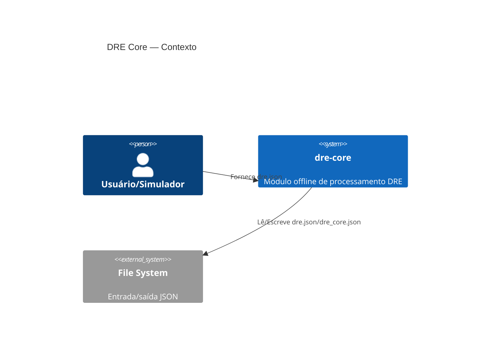
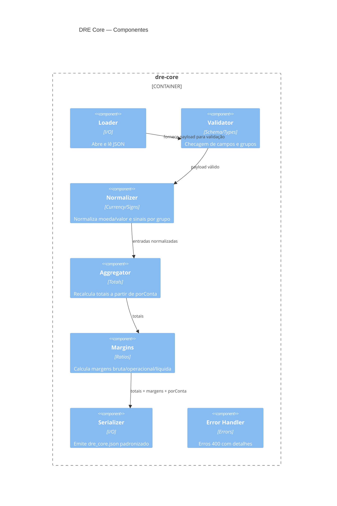
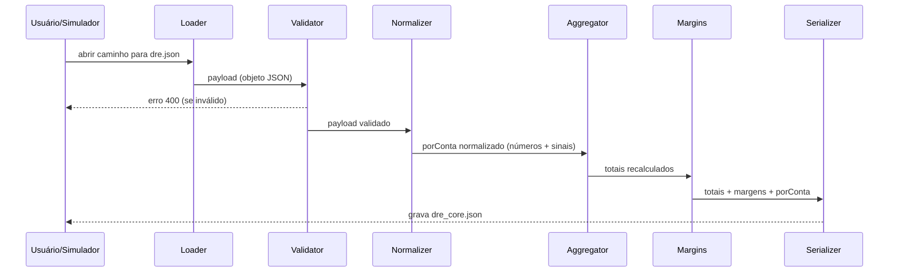
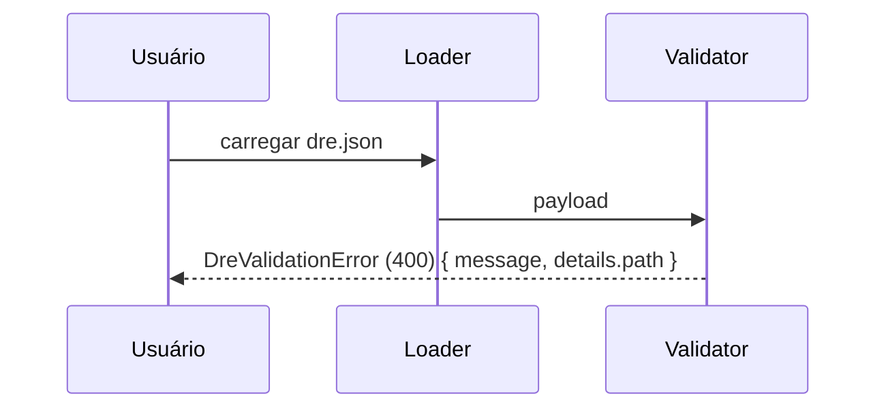

# Design — dre-core

Status: Draft (planning-only)

## Contexto

Processamento offline de um arquivo `dre.json` gerado pelo simulador, com validação de esquema, normalização de valores monetários, recálculo de totais e margens e emissão de `dre_core.json` padronizado.

## C4 — Container

## C4 — Componentes (dentro do Container `dre-core`)

## Sequências

Happy path — processar DRE

Invalid input — erro claro (400)

## Modelo de Dados (resumo)

Entrada (simulador):
- `schemaVersion:int`, `periodo:YYYY-MM`, `moeda:ISO-4217`, `totais:obj`, `porConta:[{id, nome, grupo, valor}]`

Saída (`dre_core.json`):
- Mesmo cabeçalho (`schemaVersion`, `periodo`, `moeda`)
- `porConta` com `valor:number`
- `totais` recalculados conforme regras (ver requirements)
- `margens`: `margemBruta`, `margemOperacional`, `margemLiquida`

## Regras notáveis

- Classificação de despesas em marketing por keywords no `nome` (case-insensitive): “marketing”, “ads”, “publicidade”, “propaganda”.
- Arredondamento: totais em 2 casas (half-up), margens em 4 casas.
- Divisão por zero em margens retorna 0.
